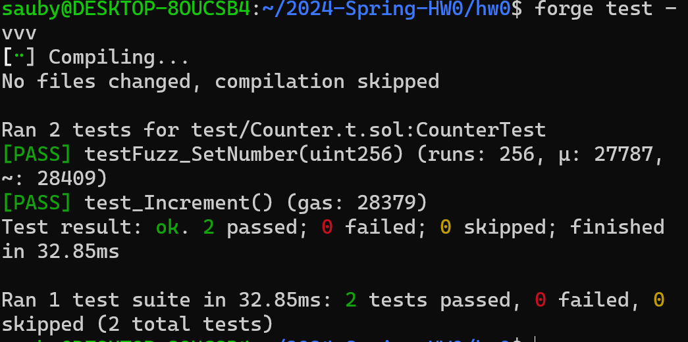
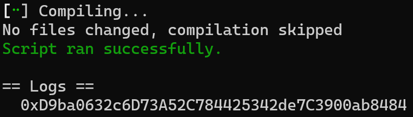
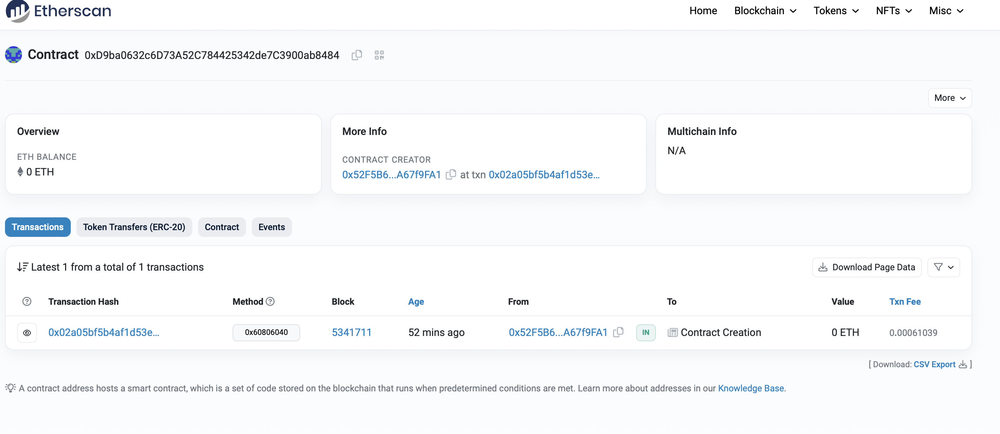

# 2024-Spring-HW0

All the detailed specified in Homework 0 documentation.

## Wallet Address
Please provide your MetaMask wallet address:
0x52F5B6Bb59d4E5104D07C853F9b066ceA67f9FA1

## Local Testing
Please provide a screenshot of the `forge test -vvv` command running in your local environment.

## Contract Address
Please provide the contract address that you deployed on the Sepolia network.
deployed contract address: 0xD9ba0632c6D73A52C784425342de7C3900ab8484

## Sepolia Etherscan
Paste the contract address into the Sepolia Etherscan and share the screenshot.

